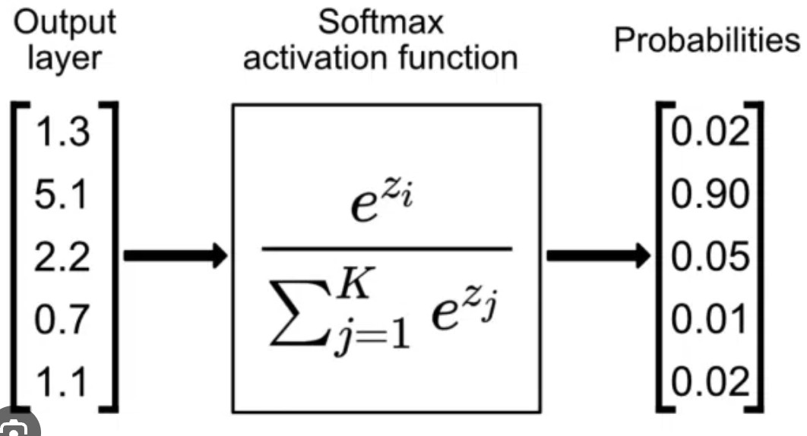
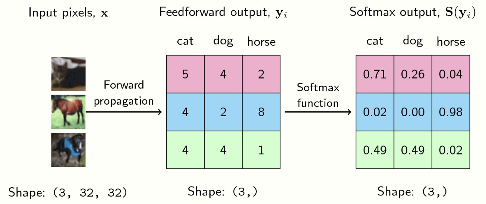

# Deep Dive into Softmax



---

## 1. Why Softmax Is Needed

In a multiclass neural network, the final layer often produces raw scores:

$$
z = [z_1, z_2, \dots, z_K]
$$

These scores are called **logits**.

### Example

Suppose a 3-class classifier outputs:

$$
z = [2, 1, 0]
$$

This means:
* Class 1 score = 2
* Class 2 score = 1
* Class 3 score = 0

### Problem

These are not probabilities because:

1. **They do not sum to 1**
   $$
   2 + 1 + 0 = 3
   $$

2. **They can be negative**
   Example: $z = [-1, 3, 0]$

3. **They are just relative scores**
   Neural networks naturally output preferences, not probabilities.

---

## 2. Softmax Formula

Softmax converts logits into probabilities:

$$
\hat{y}_i = \frac{e^{z_i}}{\sum_{j=1}^{K} e^{z_j}}
$$

### Goal

Transform $z = [2,1,0]$ into $\hat{y} = [0.665, 0.245, 0.090]$

### Probability Rules

After softmax:
* $0 \leq \hat{y}_i \leq 1$
* $\sum_{i=1}^{K}\hat{y}_i = 1$

---

## 3. Step-by-Step Example — Positive Values

**Logits:** $z = [2,1,0]$

**Step 1: Exponentiate**
$$
e^2 \approx 7.39, \quad e^1 \approx 2.72, \quad e^0 = 1
$$

**Step 2: Sum**
$$
7.39 + 2.72 + 1 = 11.11
$$

**Step 3: Normalize**
$$
\hat{y}_1 = \frac{7.39}{11.11} \approx 0.665, \quad \hat{y}_2 = \frac{2.72}{11.11} \approx 0.245, \quad \hat{y}_3 = \frac{1}{11.11} \approx 0.090
$$

**Final Result:** $\hat{y} \approx [0.665, 0.245, 0.090]$

Class 1 has the highest probability because it had the highest logit.

---

## 4. Step-by-Step Example — Including Negative Values

**Logits:** $z = [-1,0,1]$

**Step 1: Exponentiate**
$$
e^{-1} \approx 0.368, \quad e^0 = 1, \quad e^1 \approx 2.72
$$

**Step 2: Sum**
$$
0.368 + 1 + 2.72 = 4.088
$$

**Step 3: Normalize**
$$
\hat{y}_1 = \frac{0.368}{4.088} \approx 0.090, \quad \hat{y}_2 = \frac{1}{4.088} \approx 0.245, \quad \hat{y}_3 = \frac{2.72}{4.088} \approx 0.665
$$

**Final Result:** $\hat{y} \approx [0.090, 0.245, 0.665]$

**Key Insight:** Negative logits are completely valid. Softmax only cares about relative differences.

---

## 5. Example — Large Score Gap

**Logits:** $z = [10,2,-3]$

Since $e^{10} \gg e^2 \gg e^{-3}$, the softmax output is approximately $[0.9996, 0.0003, 0.0000]$.

**Interpretation:** A much larger logit creates near certainty.

---

## 6. Why Exponentials?



Exponentials do two jobs:

### A. Remove Negatives

Since $e^x > 0$ for all $x$, all values become positive.

### B. Amplify Differences

Difference between logits: $2 - 1 = 1$

But after exponentiation: $e^2 / e^1 = e \approx 2.718$

**Meaning:** Softmax magnifies stronger preferences.

---

## 7. Important Property — Relative Scores Matter More Than Absolute Scores

Compare $[2,1,0]$ and $[102,101,100]$ — softmax outputs are identical.

### Why?

Because adding the same constant changes nothing:

$$
\text{Softmax}(z) = \text{Softmax}(z + c)
$$

### Proof

$$
\frac{e^{z_i+c}}{\sum_j e^{z_j+c}} = \frac{e^c e^{z_i}}{e^c \sum_j e^{z_j}} = \frac{e^{z_i}}{\sum_j e^{z_j}}
$$

The constant cancels out.

**Core Meaning:** Softmax depends on differences, not absolute scale shifts.

---

## 8. The Numerical Stability Trick — Subtract Max

This is one of the most practical softmax tricks.

### Problem

If $z = [1000,999,998]$, then $e^{1000}$ is dangerously large and can cause numerical overflow.

### Solution

Subtract the maximum logit first:

$$
z' = z - \max(z)
$$

So $[1000,999,998] \rightarrow [0,-1,-2]$

### Stable Softmax

$$
\hat{y}_i = \frac{e^{z_i-\max(z)}}{\sum_j e^{z_j-\max(z)}}
$$

The new exponentials are $e^0 = 1$, $e^{-1} \approx 0.368$, $e^{-2} \approx 0.135$ — much safer.

Subtracting max prevents overflow without changing probabilities.

---

## 9. NumPy Implementation

### Basic Version

```python
import numpy as np

z = np.array([2.0, 1.0, 0.0])

exp_z = np.exp(z)
softmax = exp_z / np.sum(exp_z)

print("Softmax:", softmax)
print("Sum:", np.sum(softmax))
```

### Stable Version (Recommended)

```python
import numpy as np

def softmax(z):
    z = z - np.max(z)      # stability trick
    exp_z = np.exp(z)
    return exp_z / np.sum(exp_z)

z1 = np.array([2.0, 1.0, 0.0])
z2 = np.array([-1.0, 0.0, 1.0])
z3 = np.array([1000.0, 999.0, 998.0])

print("z1:", softmax(z1))
print("z2:", softmax(z2))
print("z3:", softmax(z3))
```

**Important Observation:** $[1000,999,998]$ behaves exactly like $[2,1,0]$ because relative gaps are the same.

---

## 10. Softmax vs Argmax

Softmax gives probabilities: $[0.665, 0.245, 0.090]$

Argmax gives final class: $\text{argmax}(z) = 1$

### Difference

**Softmax:** "How confident is each class?"

**Argmax:** "Which class wins?"

### Example

For $[0.40,0.35,0.25]$, argmax still picks class 1, but confidence is weak.

**Practical Rule:** Use softmax for probability distribution (training), argmax or softmax for final prediction.

---

## 11. Softmax in Neural Networks

In standard multiclass classification:

```
Input → Hidden Layers → Final Linear Layer → Logits → Softmax
```

For digit recognition, $z \in \mathbb{R}^{1 \times 10}$. Softmax converts 10 logits into 10 probabilities.

---

## 12. Temperature in Softmax (Optional)


Temperature is a hyperparameter that controls the "sharpness" of the softmax distribution. It's particularly useful in language models for controlling diversity during text generation.

### Softmax with Temperature

$$
\hat{y}_i = \frac{e^{z_i / T}}{\sum_{j=1}^{K} e^{z_j / T}}
$$

where $T > 0$ is the temperature.

### Effect of Temperature

**High temperature ($T > 1$):**
* Divides logits by a large number
* Makes the distribution more uniform
* Increases randomness/diversity in sampling
* Example: $T = 2$ on $[2,1,0]$ gives more balanced probabilities

**Low temperature ($T < 1$):**
* Multiplies logits by a large number
* Makes the distribution sharper
* Decreases randomness, favors high-probability tokens
* Example: $T = 0.5$ on $[2,1,0]$ gives near-certain prediction for class 1

**Temperature = 1:**
* Standard softmax (no modification)

### Practical Use in Language Models

* **Creative writing:** Use higher temperature (e.g., $T = 0.8-1.0$) for diverse outputs
* **Factual responses:** Use lower temperature (e.g., $T = 0.2-0.5$) for more deterministic outputs
* **Code generation:** Often uses very low temperature for correctness

---

## 13. Softmax in LLMs and Transformers (Optional)

https://poloclub.github.io/transformer-explainer/

Softmax is central in large language models.


### Next-Token Prediction

A transformer outputs vocabulary logits:

$$
z \in \mathbb{R}^{1 \times V}
$$

where $V$ is vocabulary size. Softmax converts this into $P(\text{next token})$.

**Example:** For "The cat sat on the ___", possible logits might be:
* mat: 8.2
* floor: 6.1
* moon: 1.3

Softmax converts these into token probabilities, optionally with temperature scaling.

### Attention Mechanism

Inside self-attention:

$$
\text{Attention}(Q,K,V) = \text{Softmax}\left(\frac{QK^T}{\sqrt{d_k}}\right)V
$$

Softmax turns similarity scores into attention weights, determining how much each token attends to others.
