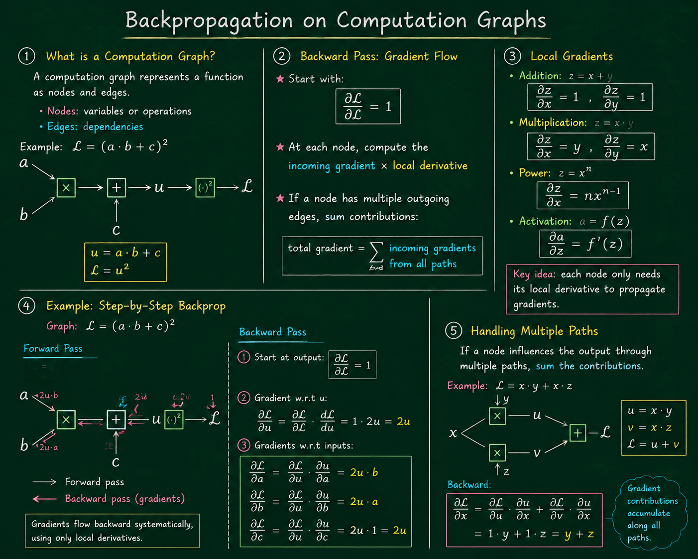

# Backpropagation on Computation Graphs

---

## 1. What is a Computation Graph?

A **computation graph** represents a function as **nodes and edges**:

* **Nodes:** variables or operations
* **Edges:** dependencies between nodes

Example: $\mathcal{L} = (a \cdot b + c)^2$

Graph:

$$
\begin{array}{ccccccccccc}
a & \searrow & & & & & & & & & \\
& & \boxed{\times} & \longrightarrow & \boxed{+} & \longrightarrow & u & \longrightarrow & \boxed{(\cdot)^2} & \longrightarrow & \mathcal{L} \\
b & \nearrow & & & \uparrow & & & & & & \\
& & & & c & & & & & & \\
\end{array}
$$

* $u = a \cdot b + c$
* $\mathcal{L} = u^2$

Each node **computes a value in the forward pass** and **stores intermediate results** for later use in backpropagation.

---

## 2. Backward Pass: Gradient Flow

The **backward pass** propagates gradients from the output node $\mathcal{L}$ back to inputs:

* Start with:

$$
\frac{\partial \mathcal{L}}{\partial \mathcal{L}} = 1
$$

* At each node, compute the **local gradient** and propagate:

$$
\underbrace{\text{incoming gradient}}_{\text{from previous node}} \; \underbrace{\text{local derivative}}_{\text{at current node}}
$$

* If a node has multiple outgoing edges, **sum contributions**:

$$
\underbrace{\text{total gradient}}_{\text{sum of all paths}} = \sum \underbrace{\text{incoming gradients from all paths}}_{\text{multiple contributions}}
$$

---

## 3. Local Gradients

Each operation knows how to compute its **partial derivatives**:

* Addition: $z = x + y$

$$
\frac{\partial z}{\partial x} = 1, \quad \frac{\partial z}{\partial y} = 1
$$

* Multiplication: $z = x \cdot y$

$$
\frac{\partial z}{\partial x} = y, \quad \frac{\partial z}{\partial y} = x
$$

* Power: $z = x^n$

$$
\frac{\partial z}{\partial x} = n x^{n-1}
$$

* Activation: $a = f(z)$

$$
\frac{\partial a}{\partial z} = f'(z)
$$

**Key idea:** each node only needs **its local derivative** to propagate gradients.

---

## 4. Example: Step-by-Step Backprop

Graph: $\mathcal{L} = (a \cdot b + c)^2$

### Forward Pass

1. $u = a \cdot b + c$
2. $\mathcal{L} = u^2$

### Backward Pass

1. Start at output:

$$
\frac{\partial \mathcal{L}}{\partial \mathcal{L}} = 1
$$

2. Compute gradient w.r.t $u$:

$$
\frac{\partial \mathcal{L}}{\partial u} = \frac{\partial \mathcal{L}}{\partial \mathcal{L}} \, \frac{d\mathcal{L}}{du} = 1 \cdot 2u = 2u
$$

3. Compute gradients w.r.t inputs:

$$
\frac{\partial \mathcal{L}}{\partial a} = \frac{\partial \mathcal{L}}{\partial u} \, \frac{\partial u}{\partial a} = 2u \cdot b
$$

$$
\frac{\partial \mathcal{L}}{\partial b} = 2u \cdot a
$$

$$
\frac{\partial \mathcal{L}}{\partial c} = 2u \cdot 1 = 2u
$$

Gradients flow backward **systematically**, using only **local derivatives**.

---

## 5. Handling Multiple Paths

If a node influences the output through **multiple paths**, sum the contributions.

Example:

$$
\mathcal{L} = x \cdot y + x \cdot z
$$

Forward:

* $u = x \cdot y$
* $v = x \cdot z$
* $\mathcal{L} = u + v$

Backward:

* $$
\frac{\partial \mathcal{L}}{\partial x} = \frac{\partial \mathcal{L}}{\partial u} \, \frac{\partial u}{\partial x} + \frac{\partial \mathcal{L}}{\partial v} \, \frac{\partial v}{\partial x} = 1 \cdot y + 1 \cdot z = y + z
$$

**Observation:** Gradient contributions **accumulate** along all paths.
