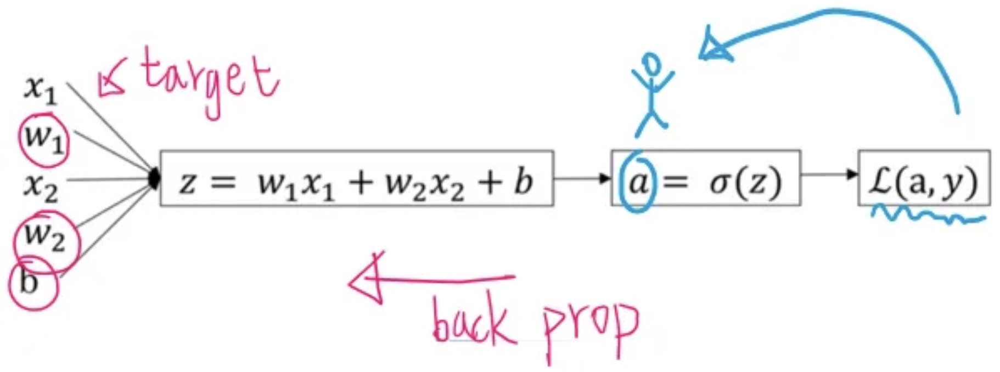

# Backpropagation in Linear Regression and Logistic Regression

---

## 1. Motivation

In previous sessions, we computed gradients for linear regression and logistic regression directly. Now we revisit them through the lens of **backpropagation** — systematically applying the **chain rule** on a **computation graph**.

**Why revisit simple models?**

* Linear regression and logistic regression are **single-layer networks**
* Their gradient derivations contain the **same patterns** used in deep neural networks
* Understanding backprop explicitly on simple cases makes the general case natural

---

## 2. Linear Regression as a Computation Graph

### 2.1 Model and Loss

Under the row-vector convention, for a single sample:

$$
\hat{y}^{(i)} = x^{(i)} W + b
$$

Where:

* $x^{(i)} \in \mathbb{R}^{1 \times d}$ — input row vector
* $W \in \mathbb{R}^{d \times 1}$ — weight matrix
* $b \in \mathbb{R}^{1 \times 1}$ — bias
* $\hat{y}^{(i)} \in \mathbb{R}$ — scalar prediction

The loss is **Mean Squared Error (MSE)** over all $n$ samples:

$$
\mathcal{L} = \frac{1}{n} \sum_{i=1}^{n} (\hat{y}^{(i)} - y^{(i)})^2
$$

### 2.2 Computation Graph

For one sample, the forward pass is a chain of operations:

$$
\large x \longrightarrow \boxed{\cdot W} \longrightarrow z \longrightarrow \boxed{b+} \longrightarrow \hat{y} \longrightarrow \boxed{-y} \longrightarrow \text{error} \longrightarrow \boxed{(\cdot)^2} \longrightarrow \ell
$$

Where $z^{(i)} = x^{(i)} W$ is the linear projection and $\ell^{(i)} = (\hat{y}^{(i)} - y^{(i)})^2$ is the per-example squared error.

### 2.3 Backward Pass: Chain Rule

We need $\frac{\partial \mathcal{L}}{\partial W}$ and $\frac{\partial \mathcal{L}}{\partial b}$. By the chain rule:

$$
\frac{\partial \ell^{(i)}}{\partial W} = \frac{\partial \ell^{(i)}}{\partial \hat{y}^{(i)}} \cdot \frac{\partial \hat{y}^{(i)}}{\partial z^{(i)}} \cdot \frac{\partial z^{(i)}}{\partial W}
$$

**Step 1: Gradient of loss w.r.t. prediction**

$$
\frac{\partial \ell^{(i)}}{\partial \hat{y}^{(i)}} = 2(\hat{y}^{(i)} - y^{(i)})
$$

**Step 2: Gradient of prediction w.r.t. pre-activation**

Since $\hat{y}^{(i)} = z^{(i)} + b$:

$$
\frac{\partial \hat{y}^{(i)}}{\partial z^{(i)}} = 1
$$

**Step 3: Gradient of pre-activation w.r.t. weights**

Since $z^{(i)} = x^{(i)} W$:

$$
\frac{\partial z^{(i)}}{\partial W} = x^{(i)\mathsf{T}}
$$

**Combine:**

$$
\frac{\partial \ell^{(i)}}{\partial W} = 2(\hat{y}^{(i)} - y^{(i)}) \cdot 1 \cdot x^{(i)\mathsf{T}} = 2 x^{(i)\mathsf{T}} (\hat{y}^{(i)} - y^{(i)})
$$

Averaging over all $n$ samples:

$$
\boxed{\frac{\partial \mathcal{L}}{\partial W} = \frac{2}{n} X^{\mathsf{T}} (\hat{Y} - Y)}
$$

Similarly for the bias (since $\frac{\partial \hat{y}^{(i)}}{\partial b} = 1$):

$$
\boxed{\frac{\partial \mathcal{L}}{\partial b} = \frac{2}{n} \sum_{i=1}^{n} (\hat{y}^{(i)} - y^{(i)}) = \frac{2}{n} \mathbf{1}^{\mathsf{T}} (\hat{Y} - Y)}
$$

### 2.4 Parameter Update

$$
W \leftarrow W - \eta \frac{\partial \mathcal{L}}{\partial W}
$$

$$
b \leftarrow b - \eta \frac{\partial \mathcal{L}}{\partial b}
$$

**Key observation:** The chain rule breaks the derivation into **local, modular steps** — the same pattern we will use for neural networks.

---

## 3. Logistic Regression as a Computation Graph

### 3.1 Model and Loss

For a single sample:

$$
z^{(i)} = x^{(i)} W + b, \quad \hat{y}^{(i)} = \sigma(z^{(i)}) = \frac{1}{1 + e^{-z^{(i)}}}
$$

Where:

* $x^{(i)} \in \mathbb{R}^{1 \times d}$ — input row vector
* $W \in \mathbb{R}^{d \times 1}$ — weight matrix
* $b \in \mathbb{R}^{1 \times 1}$ — bias
* $\hat{y}^{(i)} \in (0, 1)$ — predicted probability
* $y^{(i)} \in \{0, 1\}$ — true binary label

The loss is **Binary Cross Entropy (BCE)** over all $n$ samples:

$$
\mathcal{L} = -\frac{1}{n} \sum_{i=1}^{n} \big( y^{(i)} \log \hat{y}^{(i)} + (1 - y^{(i)}) \log(1 - \hat{y}^{(i)}) \big)
$$

### 3.2 Computation Graph

The forward pass has one additional node — the sigmoid activation:

$$
\large x \longrightarrow \boxed{\cdot W} \longrightarrow z_{temp} \longrightarrow \boxed{+b} \longrightarrow z \longrightarrow \boxed{\sigma} \longrightarrow \hat{y} \longrightarrow \boxed{\text{BCE}(y, \hat{y})} \longrightarrow \ell
$$

### 3.3 Backward Pass: Chain Rule

We need $\frac{\partial \mathcal{L}}{\partial W}$ and $\frac{\partial \mathcal{L}}{\partial b}$. The chain gives:

$$
\frac{\partial \ell^{(i)}}{\partial W} = \frac{\partial \ell^{(i)}}{\partial \hat{y}^{(i)}} \cdot \frac{\partial \hat{y}^{(i)}}{\partial z^{(i)}} \cdot \frac{\partial z^{(i)}}{\partial W}
$$

**Step 1: Gradient of BCE w.r.t. prediction**

$$
\frac{\partial \ell^{(i)}}{\partial \hat{y}^{(i)}} = -\left( \frac{y^{(i)}}{\hat{y}^{(i)}} - \frac{1 - y^{(i)}}{1 - \hat{y}^{(i)}} \right)
$$

**Step 2: Gradient of sigmoid w.r.t. pre-activation**

$$
\frac{\partial \hat{y}^{(i)}}{\partial z^{(i)}} = \hat{y}^{(i)}(1 - \hat{y}^{(i)})
$$

**Step 3: Combine the first two terms**

$$
\frac{\partial \ell^{(i)}}{\partial z^{(i)}} = \frac{\partial \ell^{(i)}}{\partial \hat{y}^{(i)}} \cdot \frac{\partial \hat{y}^{(i)}}{\partial z^{(i)}} = -\left( \frac{y^{(i)}}{\hat{y}^{(i)}} - \frac{1 - y^{(i)}}{1 - \hat{y}^{(i)}} \right) \cdot \hat{y}^{(i)}(1 - \hat{y}^{(i)}) = \hat{y}^{(i)} - y^{(i)}
$$

**Remark:** The complex fractional terms **collapse beautifully** into the simple error signal $(\hat{y}^{(i)} - y^{(i)})$. This is why Sigmoid + BCE is such an effective pairing.

**Step 4: Gradient of pre-activation w.r.t. weights**

Since $z^{(i)} = x^{(i)} W + b$:

$$
\frac{\partial z^{(i)}}{\partial W} = x^{(i)\mathsf{T}}, \quad \frac{\partial z^{(i)}}{\partial b} = 1
$$

**Combine:**

$$
\frac{\partial \ell^{(i)}}{\partial W} = x^{(i)\mathsf{T}} (\hat{y}^{(i)} - y^{(i)})
$$

Averaging over all $n$ samples:

$$
\boxed{\frac{\partial \mathcal{L}}{\partial W} = \frac{1}{n} X^{\mathsf{T}} (\hat{Y} - Y)}
$$

And for the bias:

$$
\boxed{\frac{\partial \mathcal{L}}{\partial b} = \frac{1}{n} \sum_{i=1}^{n} (\hat{y}^{(i)} - y^{(i)}) = \frac{1}{n} \mathbf{1}^{\mathsf{T}} (\hat{Y} - Y)}
$$

### 3.4 Parameter Update

$$
W \leftarrow W - \eta \frac{\partial \mathcal{L}}{\partial W}
$$

$$
b \leftarrow b - \eta \frac{\partial \mathcal{L}}{\partial b}
$$

---

## 4. Side-by-Side Comparison

| Component | Linear Regression | Logistic Regression |
| :--- | :--- | :--- |
| **Forward** | $\hat{y}^{(i)} = x^{(i)} W + b$ | $\hat{y}^{(i)} = \sigma(x^{(i)} W + b)$ |
| **Loss** | MSE: $(\hat{y}^{(i)} - y^{(i)})^2$ | BCE: $-y^{(i)} \log \hat{y}^{(i)} - (1-y^{(i)}) \log(1 - \hat{y}^{(i)})$ |
| **Error signal** | $2(\hat{y}^{(i)} - y^{(i)})$ | $(\hat{y}^{(i)} - y^{(i)})$ *(after sigmoid-BCE collapse)* |
| **Weight gradient** | $\frac{2}{n} X^{\mathsf{T}}(\hat{Y} - Y)$ | $\frac{1}{n} X^{\mathsf{T}}(\hat{Y} - Y)$ |
| **Bias gradient** | $\frac{2}{n} \mathbf{1}^{\mathsf{T}}(\hat{Y} - Y)$ | $\frac{1}{n} \mathbf{1}^{\mathsf{T}}(\hat{Y} - Y)$ |

**Pattern:** Both follow the same structure:

1. Compute prediction through a forward chain
2. Compute error signal at the output
3. Propagate backward through local derivatives
4. Multiply by input transpose to get weight gradients

The only differences are the **loss function** (MSE vs. BCE) and the **activation** (none vs. sigmoid), which change the error signal.

---

## 5. Summary

1. **Backpropagation = chain rule on a computation graph** — even for simple models.
2. **Linear regression** has no activation; the error signal is $2(\hat{y}^{(i)} - y^{(i)})$.
3. **Logistic regression** has a sigmoid activation; the BCE-sigmoid pair collapses to the elegant error signal $(\hat{y}^{(i)} - y^{(i)})$.
4. In both cases, weight gradients have the form **input transpose × error signal**.

