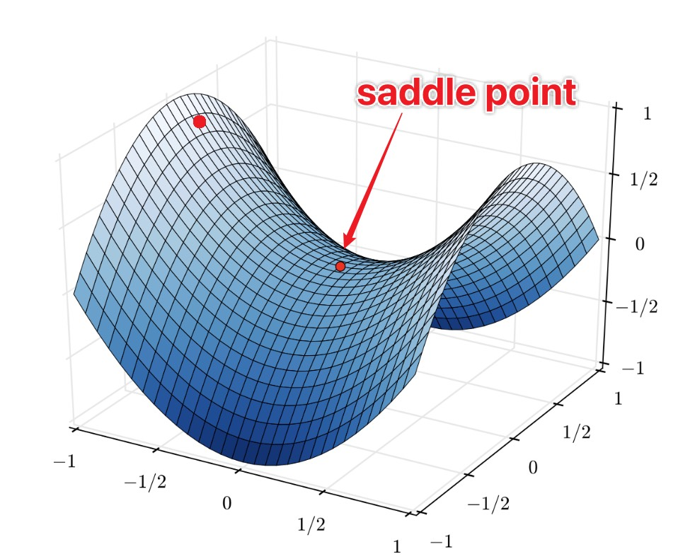

# From Gradient Descent to Stochastic Gradient Descent

---

## 1. Full-Batch Gradient Descent

Recall standard gradient descent on the full dataset:

$$
W \leftarrow W - \eta \frac{\partial \mathcal{L}}{\partial W}, \quad \mathcal{L} = \frac{1}{n} \sum_{i=1}^n \mathcal{L}_i(W)
$$

In row-vector notation for a linear layer:
$$
z = xW + b, \quad W \leftarrow W - \eta \frac{\partial \mathcal{L}}{\partial W}
$$

* $n$ — total number of training samples
* $\mathcal{L}_i(W)$ — loss for the $i$-th sample

**Observation:** Computing $\frac{\partial \mathcal{L}}{\partial W}$ requires summing over all $n$ samples each step.

* Accurate gradient estimates
* Smooth convergence
* But very expensive for large datasets

---

## 2. The Inefficiency Problem

For modern datasets:

* $n$ can be millions or more
* Each iteration takes a long time
* Full-batch updates are slow, even if precise

**Key insight:** Exact gradient is not always necessary — an approximate gradient is often sufficient for learning.

---

## 3. Stochastic Gradient Descent (Mini-Batch GD)

Stochastic gradient descent approximates the full gradient by computing it over a **small batch of samples**:

$$
W \leftarrow W - \eta \frac{1}{B} \sum_{i \in \mathcal{B}} \frac{\partial \mathcal{L}_i}{\partial W}
$$

* $B$ — batch size ($1 \le B < n$)
* $\mathcal{B}$ — set of indices for the current mini-batch

**Advantages:**

* Updates are cheaper than full-batch GD
* Faster per iteration
* Introduces stochasticity that can help optimization

---

## 4. Intuition: Noisy Descent Helps

* Mini-batch updates are **noisy approximations** of the true gradient
* Noise allows escaping **shallow local minima or saddle points**

**Visualization:** Descending a bumpy valley:

* Full-batch GD → precise but slow path
* SGD (mini-batch) → jittery path that explores valleys and escapes plateaus

---

## 5. Choosing Batch Size

* Small batch → more noise, faster iteration
* Large batch → smoother gradient, slower iteration

Typical guidelines:

| Dataset Size | Batch Size |
| ------------ | ---------- |
| Small        | 16–64      |
| Medium       | 64–256     |
| Large        | 256–1024+  |

> Batch size interacts with learning rate: smaller batches often require smaller $\eta$ for stability.

---

## 6. Summary

* Full-batch GD: precise but computationally expensive
* Stochastic GD (mini-batch): cheaper, faster, introduces helpful noise
* Batch size controls the trade-off between gradient variance and efficiency
* Momentum improves stability and speed

**Key takeaway:** Modern deep learning almost always relies on **mini-batch SGD with adaptive learning rates**. Full-batch GD is mostly theoretical.
