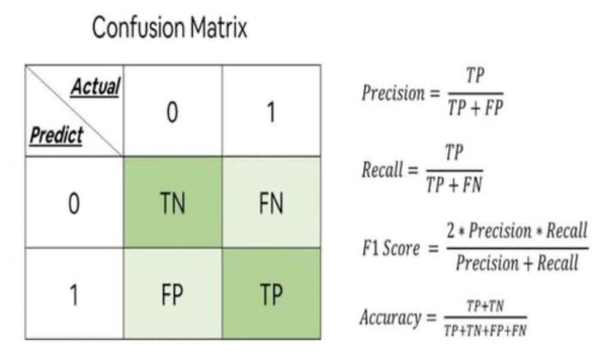
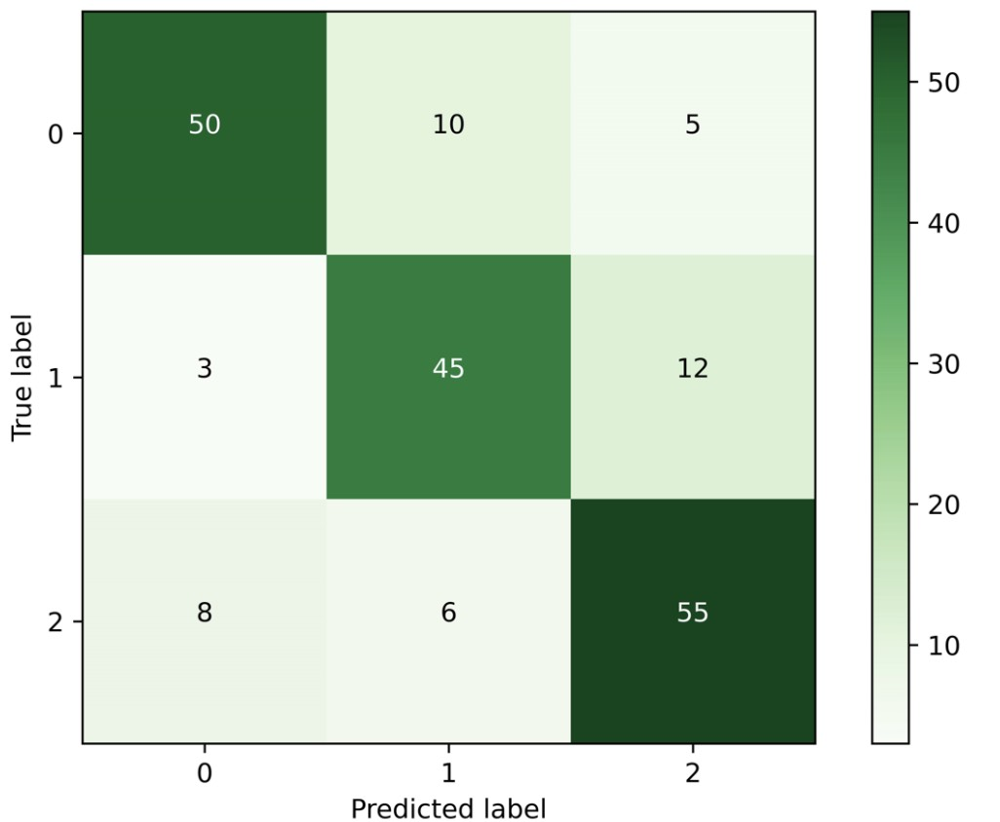
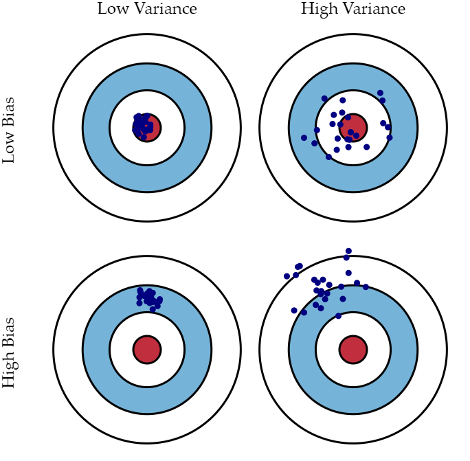
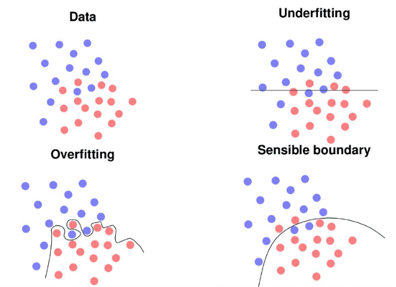
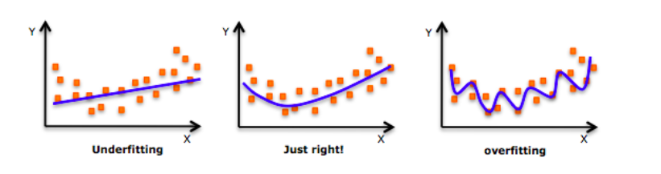
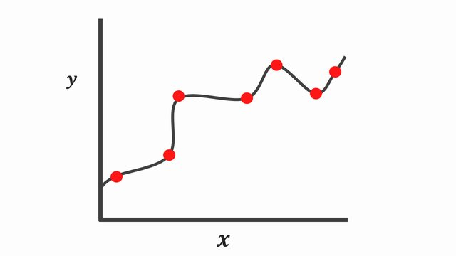
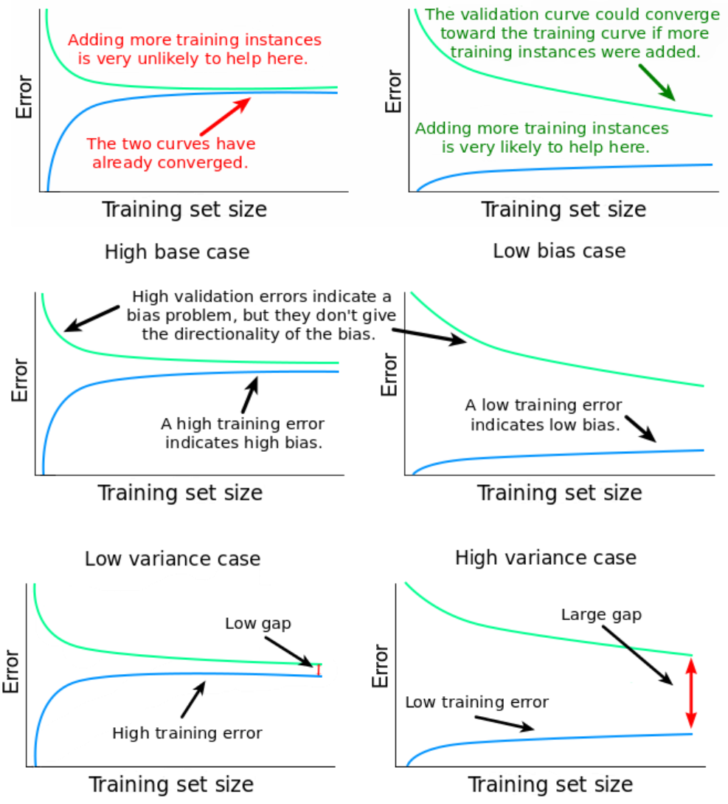
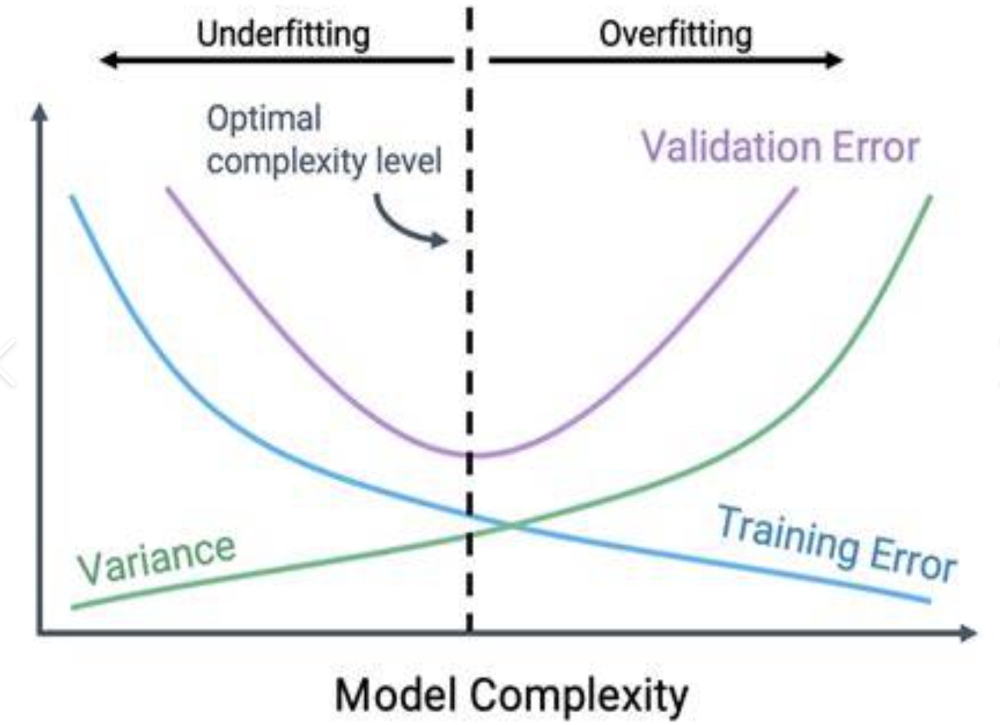
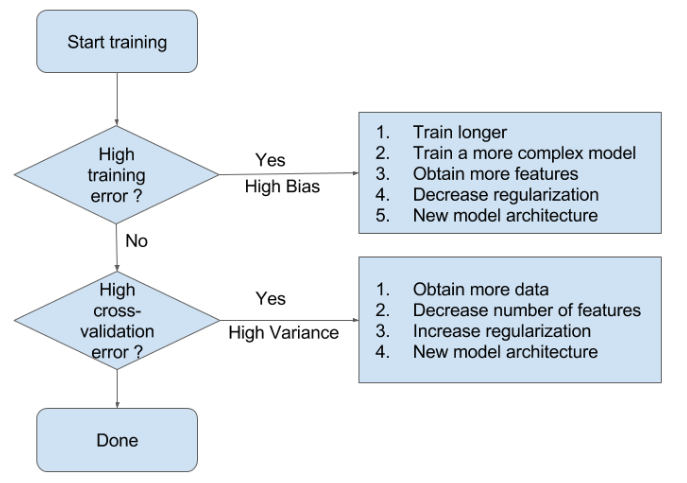
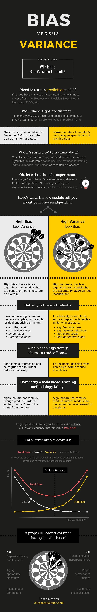

# Model Selection Part 1

---

# 1. Generalization Error

We want to estimate:

**How well will the model perform on future unseen data?**

Since we do not know future data, we simulate it using:

* validation datasets
* test datasets
* cross-validation

---

# 2. Evaluation Metrics

Different machine learning tasks require **different metrics**.

There is **no single universal metric**.

---

# 2.1 Classification Metrics

## Accuracy

The simplest metric is **accuracy**.

Accuracy is defined as:

$$
Accuracy = \frac{\text{Number of Correct Predictions}}{\text{Total Predictions}}
$$

However, accuracy can be **misleading**.

---

## Accuracy Problem: Imbalanced Data

Example: Fraud Detection

Dataset:

| Class      | Percentage |
| ---------- | ---------- |
| Legitimate | 99%        |
| Fraud      | 1%         |

A model that predicts **always "Legitimate"** achieves:

Accuracy = **99%**

But it detects **zero fraud cases**.

This is clearly **a useless model**.

---

# 2.2  Confusion Matrix 

# Binary Classifiction

A better analysis tool is the **confusion matrix**.

|                 | Predicted Positive  | Predicted Negative  |
| --------------- | ------------------- | ------------------- |
| Actual Positive | True Positive (TP)  | False Negative (FN) |
| Actual Negative | False Positive (FP) | True Negative (TN)  |

From this matrix we derive better metrics.

---

# Precision

Precision measures **how reliable positive predictions are**.

$$
Precision = \frac{TP}{TP + FP}
$$

High precision means:

> When the model predicts positive, it is usually correct.

Example use case:

* spam detection

---

# Recall

Recall measures **how many true positives we detect**.

$$
Recall = \frac{TP}{TP + FN}
$$

High recall means:

> The model rarely misses positive cases.

Example use case:

* disease screening
* fraud detection

---

# F1 Score

F1 combines precision and recall.

$$
F1 = 2 \times \frac{Precision \times Recall}{Precision + Recall}
$$

F1 is useful when:

* the dataset is **imbalanced**
* both precision and recall matter

---

# Confusion Matrix for Binary Classifiction

By using a one-vs-rest strategy and averaging metrics (macro/micro), these concepts extend directly to multi-class classification.

---

# 2.3 Regression Metrics

For regression tasks we measure **prediction error**.

---

## Mean Squared Error (MSE)

$$
MSE = \frac{1}{n}\sum (y - \hat{y})^2
$$

---

## Mean Absolute Error (MAE)

$$
MAE = \frac{1}{n}\sum \|y - \hat{y}\|
$$

---

## R² Score

The **R² score (coefficient of determination)** measures **how well a regression model explains the variation in the data**.

It compares the model’s prediction error with a simple baseline model that **always predicts the mean of the target variable**.

$$R^2 = 1 - \frac{SS_{res}}{SS_{tot}}$$

Where:

* **$SS_{res}$** — *Residual Sum of Squares*
  Measures the total squared error between the true values and the model predictions.

$$
SS_{res} = \sum_{i=1}^{n}(y_i - \hat{y}_i)^2
$$

* **$SS_{tot}$** — *Total Sum of Squares*
  Measures the total variation of the true values relative to their mean.

$$
SS_{tot} = \sum_{i=1}^{n}(y_i - \bar{y})^2
$$

Intuitively:

* $SS_{tot}$ represents **how much the data varies overall**.
* $SS_{res}$ represents **how much error remains after using the model**.

Therefore, R² tells us **what proportion of the data's variance is explained by the model**.

## Interpretation

| R² | Meaning                                           |
| -- | ------------------------------------------------- |
| 1  | perfect prediction                                |
| 0  | model performs no better than predicting the mean |
| <0 | model performs worse than predicting the mean     |

For example:

* **R² = 0.8** means the model explains **80% of the variance in the data**.
* **R² = 0** means the model is **no better than a constant baseline prediction**.
* **R² < 0** indicates the model's predictions are **worse than simply predicting the average value**.

---

# 3. Evaluation Methods

Metrics alone are not enough.

We also need **reliable evaluation procedures**.

---

# 3.1 Train / Validation / Test Split

Typical workflow:

Dataset → split into three parts.

| Dataset    | Purpose                |
| ---------- | ---------------------- |
| Train      | train model            |
| Validation | choose hyperparameters |
| Test       | final evaluation       |

Typical ratios:

* 70 / 15 / 15
* 80 / 10 / 10

Important rule:

> The **test set must only be used once**.

Using the test set repeatedly leads to **information leakage**.

Check out our code `code-my_nn.py`.

---

# 3.2 K-Fold Cross Validation

Cross-validation provides a **more robust evaluation**.

Procedure:

1. Split dataset into **K folds**
2. Train the model **K times**
3. Each time, one fold is used for validation
4. Average the performance

---

# 4. Bias–Variance Tradeoff

## High Bias (Underfitting)

High bias occurs when the model is **too simple**.

Symptoms:

* training error is high
* validation error is also high

Example models:

* linear model for nonlinear data
* shallow decision tree

https://visualize-it.github.io/polynomial_regression/simulation.html

## High Variance (Overfitting)

High variance occurs when the model is **too complex**.

Symptoms:

* training error very low
* validation error much higher

The model **memorizes training data noise**.

---

# 5. Diagnosis Using Curves

Instead of guessing, we use **diagnostic curves**.

---

# 5.1 Learning Curves

## Case 1: High Bias

Training error: high
Validation error: high

The curves are **close together**.

Interpretation:

The model is too simple.

---

## Case 2: High Variance

Training error: low
Validation error: high

Large gap between curves.

Interpretation:

The model is overfitting.

---

# 5.2 Validation Curves

Validation curves analyze **model complexity**.

X-axis: model complexity

Examples:

* polynomial degree
* tree depth
* regularization strength

Typical pattern:

Underfitting → Good Fit → Overfitting

This helps find the **optimal complexity level**.

# 5.3 How to choose a good model

# 6. Regularization

See [lecture-why-we-do-not-want-large-weights.md](./lecture-why-we-do-not-want-large-weights.md).

See [lecture-2-L1-L2.md](./lecture-2-L1-L2.md).

