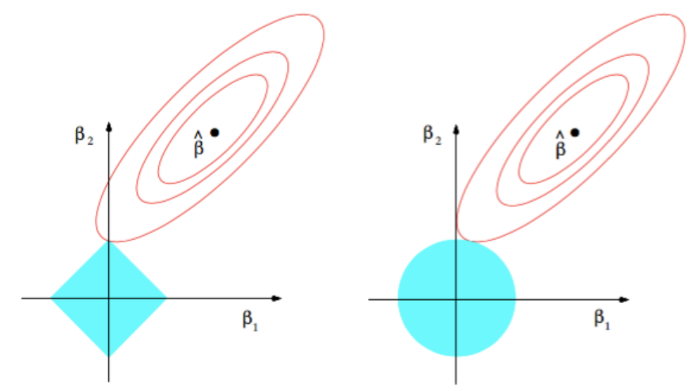
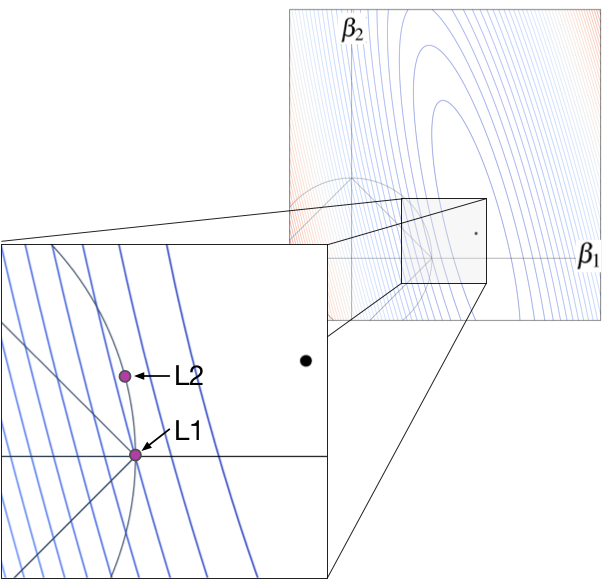

# L1 and L2 Regularization

---

## 1. Problem Formulation

We consider the regularized optimization problem:

$$
\min_w \ \mathcal{L}(w) + \lambda  \Omega(w)
$$

where:

* $\mathcal{L}(w)$ is the data loss
* $\Omega(w)$ is a regularization term
* $\lambda > 0$ controls the strength

Two choices:

---

### L2 Regularization

$$
\Omega(w) = \sum_{j=1}^d w_j^2
$$

---

### L1 Regularization

$$
\Omega(w) = \sum_{j=1}^d \|w_j\|
$$

---

## 2. Mathematical Effect on Optimization

---

### 2.1 L2: Quadratic Penalization

The objective becomes:

$$
\mathcal{L}(w) + \lambda \sum_{j=1}^d w_j^2
$$

Gradient contribution:

$$
\frac{\partial}{\partial w_j} = \frac{\partial \mathcal{L}}{\partial w_j} + 2\lambda w_j
$$

---

#### Interpretation

* Each weight experiences a force proportional to its magnitude
* Larger weights are penalized more strongly
* The shrinkage is **continuous and smooth**

---

### 2.2 L1: Linear Penalization

The objective becomes:

$$
\mathcal{L}(w) + \lambda \sum_{j=1}^d \|w_j\|
$$

Subgradient:

$$
\frac{\partial}{\partial w_j} \in \frac{\partial \mathcal{L}}{\partial w_j} + \lambda \cdot \text{sign}(w_j)
$$

---

#### Interpretation

* All nonzero weights experience the same magnitude of shrinkage
* There is a discontinuity at $w_j = 0$
* This creates a **thresholding effect**

---

## 3. Shrinkage Behavior

---

### 3.1 L2 Shrinkage

Weights are updated toward zero proportionally:

$$
w_j \rightarrow w_j - 2\lambda w_j
$$

---

#### Effect

* Large weights shrink faster
* Small weights shrink slowly
* Rarely produces exact zeros

---

### 3.2 L1 Shrinkage

Weights are pushed toward zero with constant force:

$$
w_j \rightarrow w_j - \lambda \cdot \text{sign}(w_j)
$$

---

#### Effect

* Small weights are easily driven to zero
* Produces exact sparsity

---

## 4. Geometric Interpretation

---

### 4.1 Constrained Form

Equivalent constrained problems:

---

#### L2 Constraint

$$
\sum_{j=1}^d w_j^2 \leq c
$$

→ Euclidean ball

---

#### L1 Constraint

$$
\sum_{j=1}^d \|w_j\| \leq c
$$

→ Cross-polytope (diamond in 2D)

---

### 4.2 Interaction with Loss Contours

The solution is where:

* loss contours
* constraint boundary

first touch.

---

### 4.3 L2 Geometry

* Boundary is smooth
* Tangency occurs at generic points

---

#### Consequence

* All coordinates typically nonzero
* No coordinate is preferred

---

### 4.4 L1 Geometry

* Boundary has sharp corners
* Corners align with coordinate axes

---

#### Consequence

* Solutions often occur at corners

$$
w_j = 0 \text{ for many } j
$$

---

## 5. Sparsity vs Distribution

---

### L2 Regularization

* Produces **dense solutions**
* Information is distributed across features
* No explicit feature selection

---

### L1 Regularization

* Produces **sparse solutions**
* Many weights exactly zero
* Performs implicit feature selection

---

## 6. Effect on Model Complexity

---

### 6.1 L2

Controls complexity by:

* penalizing large magnitudes
* smoothing the function

---

#### Functional Interpretation

* discourages sharp curvature
* reduces sensitivity

---

### 6.2 L1

Controls complexity by:

* reducing the number of active parameters

---

#### Functional Interpretation

* simplifies model structure
* enforces parsimony

## 7. Final Perspective

L2 answers:

> how do we keep all parameters small?

L1 answers:

> how do we keep only the essential parameters?

Practical guideline:

* **L2 is usually the default**
* **L1 is useful when many features are irrelevant**
