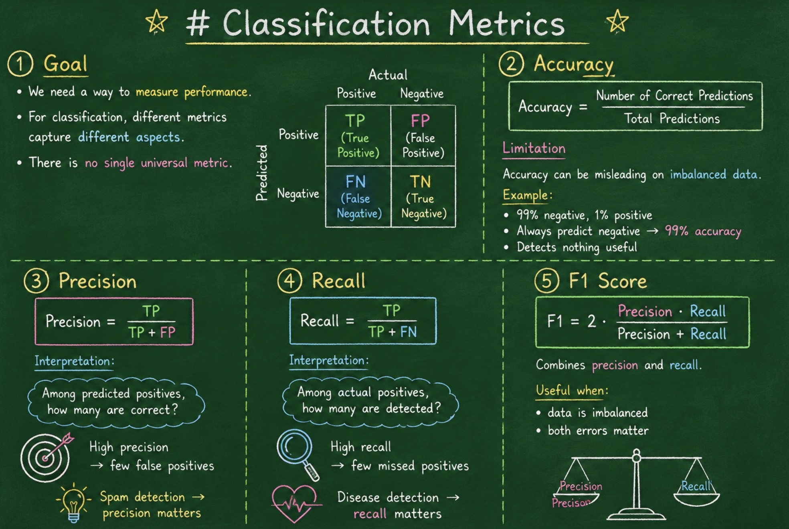

# Classification Metrics

---

## 1. Goal

We need a way to **measure performance**.

For classification, different metrics capture different aspects.

There is **no single universal metric**.

---

## 2. Accuracy

$$
\text{Accuracy} = \frac{\text{Number of Correct Predictions}}{\text{Total Predictions}}
$$

### Limitation

Accuracy can be misleading on **imbalanced data**.

Example:

* 99% negative, 1% positive
* Always predict negative → 99% accuracy
* Detects nothing useful

---

## 3. Precision

$$
\text{Precision} = \frac{TP}{TP + FP}
$$

Interpretation:

> Among predicted positives, how many are correct?

High precision → few false positives

Spam detection → precision matters

---

## 4. Recall

$$
\text{Recall} = \frac{TP}{TP + FN}
$$

Interpretation:

> Among actual positives, how many are detected?

High recall → few missed positives

Disease detection → recall matters

---

## 5. F1 Score 

$$
F1 = 2 \cdot \frac{\text{Precision} \cdot \text{Recall}}{\text{Precision} + \text{Recall}}
$$

Combines precision and recall.

Useful when:

* data is imbalanced
* both errors matter
