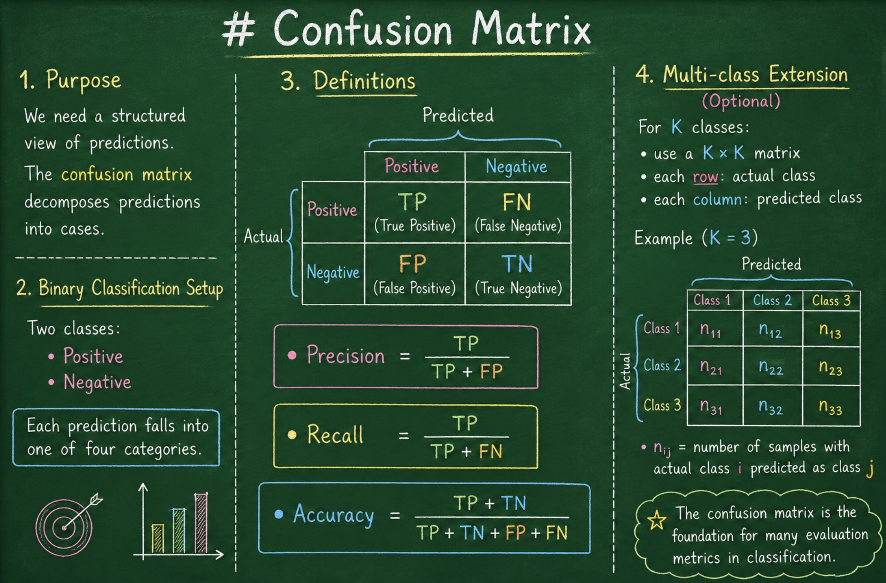

# Confusion Matrix

---

## 1. Purpose

We need a structured view of predictions.

The **confusion matrix** decomposes predictions into cases.

---

## 2. Binary Classification Setup

Two classes:

* Positive
* Negative

Each prediction falls into one of four categories.

---

## 3. Definitions

|                 | Predicted Positive | Predicted Negative |
| --------------- | ------------------ | ------------------ |
| Actual Positive | TP                 | FN                 |
| Actual Negative | FP                 | TN                 |

$$
\text{Precision} = \frac{TP}{TP + FP}
$$

$$
\text{Recall} = \frac{TP}{TP + FN}
$$

$$
\text{Accuracy} = \frac{TP + TN}{TP + TN + FP + FN}
$$

---

## 4. Multi-class Extension (Optional)

For $K$ classes:

* use a $K \times K$ matrix
* each row: actual class
* each column: predicted class
