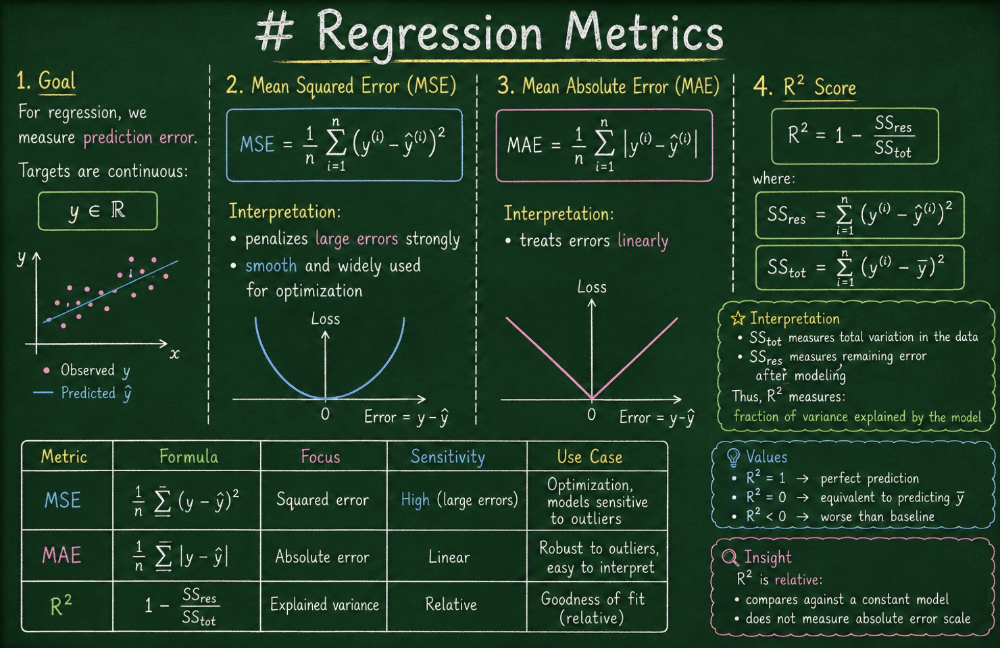

# Regression Metrics

---

## 1. Goal

For regression, we measure **prediction error**.

Targets are continuous:

$$
y \in \mathbb{R}
$$

---

## 2. Mean Squared Error (MSE)

$$
MSE = \frac{1}{n} \sum_{i=1}^{n} (y^{(i)} - \hat{y}^{(i)})^2
$$

Interpretation:

* penalizes large errors strongly
* smooth and widely used for optimization

---

## 3. Mean Absolute Error (MAE)

$$
MAE = \frac{1}{n} \sum_{i=1}^{n} \|y^{(i)} - \hat{y}^{(i)}\|
$$

Interpretation:

* treats errors linearly

---

## 4. R² Score

$$
R^2 = 1 - \frac{SS_{res}}{SS_{tot}}
$$

where:

$$
SS_{res} = \sum_{i=1}^{n} (y^{(i)} - \hat{y}^{(i)})^2
$$

$$
SS_{tot} = \sum_{i=1}^{n} (y^{(i)} - \bar{y})^2
$$

#### Interpretation

* $SS_{tot}$ measures total variation in the data
* $SS_{res}$ measures remaining error after modeling

Thus, $R^2$ measures:

> **fraction of variance explained by the model**

#### Values

* $R^2 = 1$ → perfect prediction
* $R^2 = 0$ → equivalent to predicting $\bar{y}$
* $R^2 < 0$ → worse than baseline

#### Insight

$R^2$ is **relative**:

* compares against a constant model
* does not measure absolute error scale

---

## 5. Beyond Standard Losses (Optional; Let's go a bit wild ...)

MSE uses a **quadratic penalty**.

More generally, we can define:

$$
\frac{1}{n} \sum_{i=1}^{n} \|y^{(i)} - \hat{y}^{(i)}\|^p
$$

for different powers $p$.

* $p = 2$ → standard MSE
* $p > 2$ → increasingly penalizes large errors
* $p < 2$ → reduces sensitivity to outliers

Higher-order losses (e.g., cubic, quartic) amplify large deviations even more aggressively.
