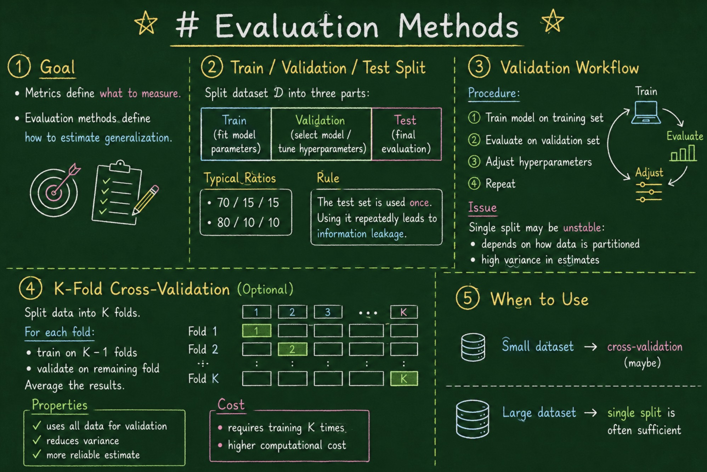
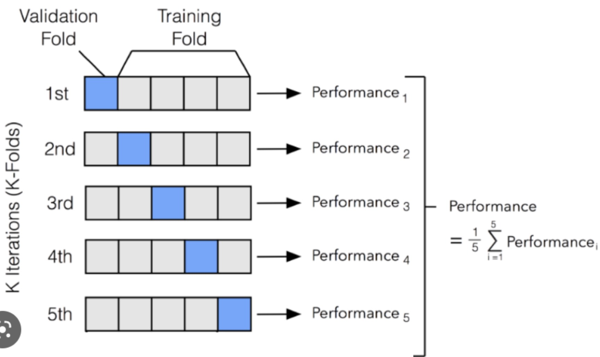

# Evaluation Methods

---

## 1. Goal

Metrics define **what to measure**.

Evaluation methods define **how to estimate generalization**.

---

## 2. Train / Validation / Test Split

Split dataset $\mathcal{D}$ into three parts:

* Train: fit model parameters
* Validation: select model / tune hyperparameters
* Test: final evaluation

---

## Typical Ratios

* 70 / 15 / 15
* 80 / 10 / 10

---

## Rule

The test set is used **once**.

Using it repeatedly leads to **information leakage**.

---

## 3. Validation Workflow

Procedure:

1. Train model on training set
2. Evaluate on validation set
3. Adjust hyperparameters
4. Repeat

---

#### Issue

Single split may be **unstable**:

* depends on how data is partitioned
* high variance in estimates

---

## 4. K-Fold Cross-Validation (Optional)

Split data into $K$ folds.

For each fold:

* train on $K-1$ folds
* validate on remaining fold

Average the results.

---

#### Properties

* uses all data for validation
* reduces variance
* more reliable estimate

---

#### Cost

* requires training $K$ times
* higher computational cost

---

## 5. When to Use

* small dataset → cross-validation (maybe)
* large dataset → single split is often sufficient
