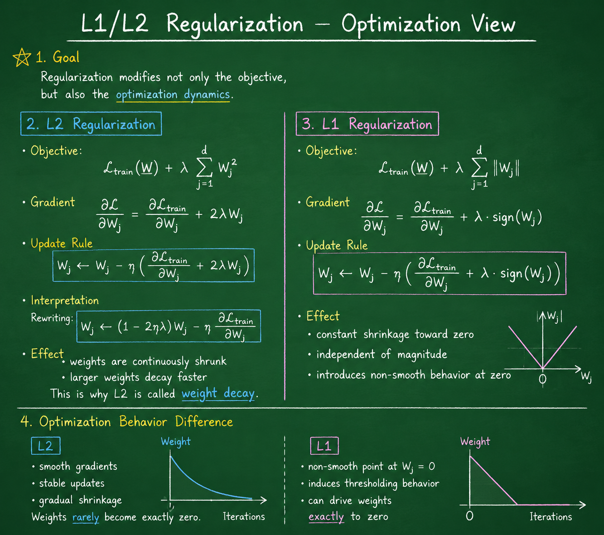
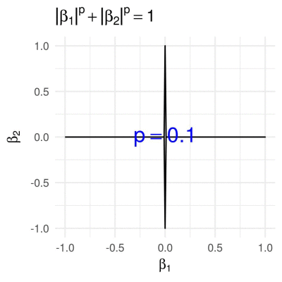

# L1/L2 Regularization — Formulation

---

## 1. Motivation

Models can overfit by using overly complex parameters.

We control this by adding a **constraint on parameters**.

---

## 2. Regularized Objective

We modify the optimization problem:

$$
\min_{W} \ \mathcal{L}_{\text{train}}(W) + \lambda \Omega(W)
$$

where:

* $\mathcal{L}_{\text{train}}(W)$: data loss
* $\Omega(W)$: regularization term
* $\lambda > 0$: strength of regularization

---

## 3. L2 Regularization

Also called **weight decay**.

$$
\min_{W} \ \mathcal{L}_{\text{train}}(W) + \lambda \sum_{j=1}^{d} W_j^2
$$

#### Effect

* penalizes large weights
* encourages smooth solutions
* keeps all parameters small

---

## 4. L1 Regularization

$$
\min_{W} \ \mathcal{L}_{\text{train}}(W) + \lambda \sum_{j=1}^{d} \|W_j\|
$$

#### Effect

* promotes sparsity
* many weights become exactly zero
* performs implicit feature selection

---

## 5. Comparison

| Property   | L2            | L1             |
| ---------- | ------------- | -------------- |
| Penalty    | quadratic     | linear         |
| Effect     | small weights | sparse weights |
| Smoothness | smooth        | non-smooth     |
| Sparsity   | no            | yes            |

---

## 6. Interpretation

Regularization changes the learning objective:

* from pure data fitting
* to **data fitting + complexity control**
