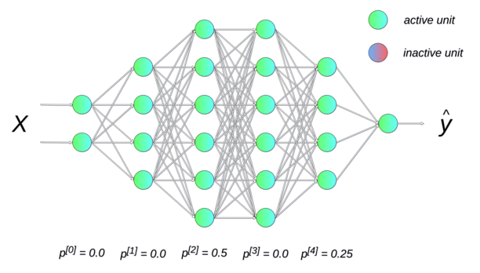
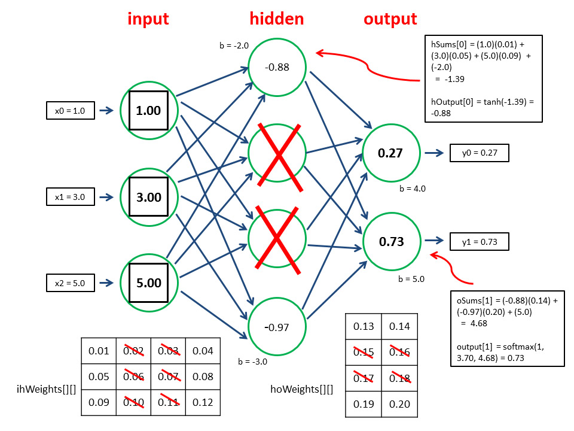
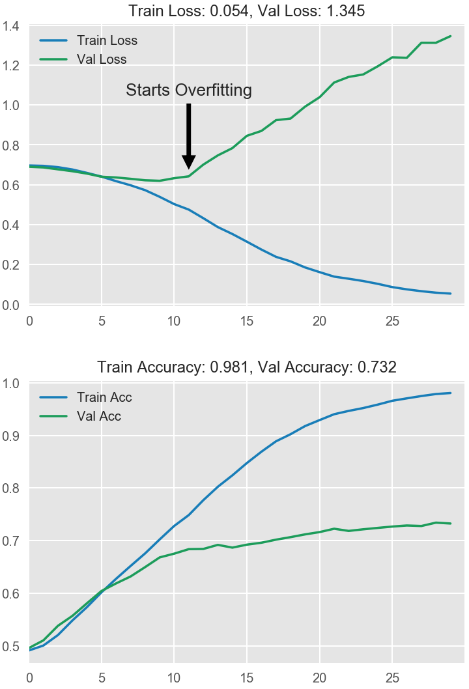
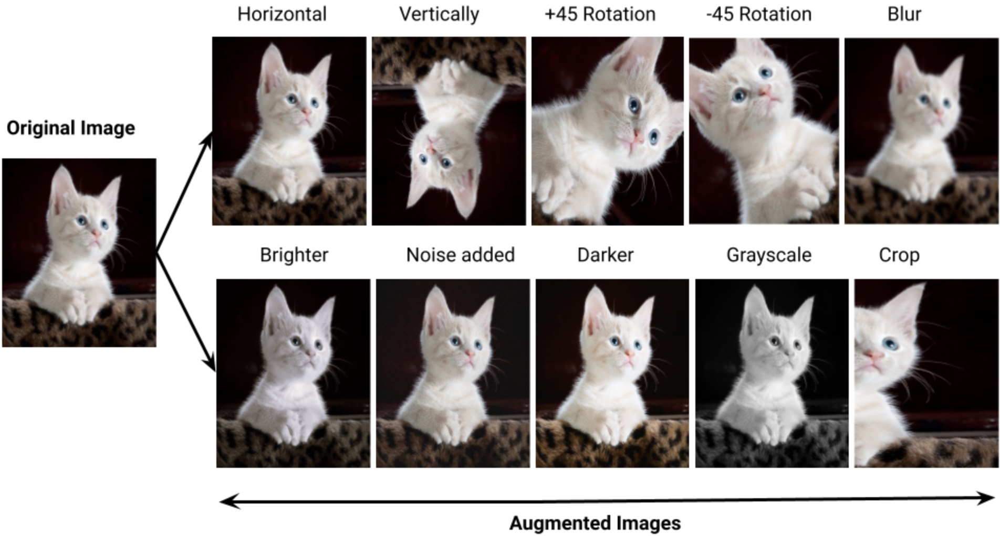
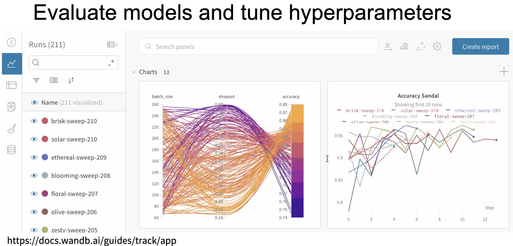

# Model Selection Part 2

---

# 1. Regularization for Neural Networks

- One good example of NN overfitting: [Tensorflow PlayGround](https://playground.tensorflow.org/#activation=relu&batchSize=10&dataset=gauss&regDataset=reg-plane&learningRate=0.03&regularizationRate=0.001&noise=50&networkShape=8,8,8,8,8,8&seed=0.67177&showTestData=false&discretize=false&percTrainData=50&x=true&y=true&xTimesY=true&xSquared=true&ySquared=true&cosX=false&sinX=true&cosY=false&sinY=true&collectStats=false&problem=classification&initZero=false&hideText=false&activation_hide=false&percTrainData_hide=true&batchSize_hide=true&noise_hide=false&numHiddenLayers_hide=false&problem_hide=true&dataset_hide=false)


Neural networks often contain **millions of parameters**, so overfitting is common.

Several specialized techniques are used.

---

# 1.1 Dropout



Dropout randomly disables neurons during training.

Example:

Each neuron has probability $p$ of being dropped.

This forces the network to:

* learn redundant representations
* avoid reliance on specific neurons


---

## Intuition



Dropout acts like **training many different networks simultaneously**.

This behavior is similar to **model ensemble methods**.

---

## Example (PyTorch)

```python
import torch.nn as nn

model = nn.Sequential(
    nn.Linear(784, 256),
    nn.ReLU(),
    nn.Dropout(p=0.5),
    nn.Linear(256, 10)
)
```

Here:

```
p = 0.5
```

means 50% of neurons are randomly dropped during training.

---

# 1.2 Early Stopping

Early stopping monitors **validation performance during training**.

If validation loss starts increasing, we stop training.




---

## Why It Works

During training:

1. Training loss keeps decreasing
2. Validation loss first decreases
3. Then validation loss increases (overfitting begins)

Early stopping halts training at the optimal point.

---

## Example Code

```python
best_val_loss = float("inf")
patience = 5
counter = 0

for epoch in range(epochs):

    train_model()

    val_loss = evaluate()

    if val_loss < best_val_loss:
        best_val_loss = val_loss
        counter = 0
    else:
        counter += 1

    if counter >= patience:
        print("Early stopping")
        break
```


---

# 2. Data Augmentation

Another way to prevent overfitting is to **increase the effective size of the training dataset**.

Instead of collecting new data, we **transform existing data** to generate additional variations.

This helps the model learn **robust and invariant features**.


---

## Common Image Transformations

Typical data augmentation techniques include:

* rotation
* cropping
* flipping
* color jitter
* **Gaussian noise**
* **Gaussian blur**

These transformations simulate **real-world variations** in data.




---

## Example (PyTorch)

```python
from torchvision import transforms

transform = transforms.Compose([
    transforms.RandomHorizontalFlip(),
    transforms.RandomRotation(10),
    transforms.RandomCrop(28),
    transforms.ColorJitter(brightness=0.2, contrast=0.2),
    transforms.GaussianBlur(kernel_size=3)
])
```

This pipeline randomly applies transformations to each image during training.

Adding Gaussian noise forces the model to:

* ignore small perturbations
* focus on **important structural features**

This improves **generalization**.

The model becomes more robust to:

* sensor noise
* compression artifacts
* lighting variation

## Visual Intuition

Original Image → Slightly Noisy Image

Humans can still recognize the object easily.

But the model must learn:

> the object **independent of noise**

This improves robustness.

This pipeline introduces **multiple sources of variability**.

You can think augmentation as:

> Data Augmentation ≈ **synthetic data generation**

Instead of:

```
collect more data
```

we create:

```
more variations of existing data
```

This is especially important when:

* datasets are small
* labeling is expensive
* collecting new data is difficult

---

# 3. Hyperparameter Optimization



Machine learning models have **hyperparameters**.

Examples:

* regularization strength $\lambda$
* learning rate
* number of layers
* tree depth
* batch size

These parameters are **not learned automatically**.

They must be **searched for manually**.

---

# 3.1 Grid Search

Grid search tests all combinations of predefined values.

Example parameter grid:

```
learning_rate = [0.01, 0.001]
batch_size = [32, 64]
layers = [2, 3]
```

Total combinations:

```
2 × 2 × 2 = 8 models
```

---

## Example Code

```python
from sklearn.model_selection import GridSearchCV
from sklearn.svm import SVC

param_grid = {
    "C": [0.1, 1, 10],
    "kernel": ["linear", "rbf"]
}

grid = GridSearchCV(SVC(), param_grid, cv=5)

grid.fit(X_train, y_train)

print(grid.best_params_)
```

---

## Advantages

* simple
* systematic
* guaranteed coverage

---

## Disadvantages

* computationally expensive
* suffers from **curse of dimensionality**

---

# 3.2 Random Search

Random search samples parameters randomly.

Instead of testing all combinations, it tests **random points in parameter space**.

---

## Example Code

```python
from sklearn.model_selection import RandomizedSearchCV

param_dist = {
    "C": [0.01, 0.1, 1, 10],
    "gamma": [0.001, 0.01, 0.1]
}

search = RandomizedSearchCV(
    SVC(),
    param_dist,
    n_iter=10,
    cv=5
)

search.fit(X_train, y_train)
```

---

## Why Random Search Works Well

See [lecture-why-random-search-works-well.md](lecture-why-random-search-works-well.md)
