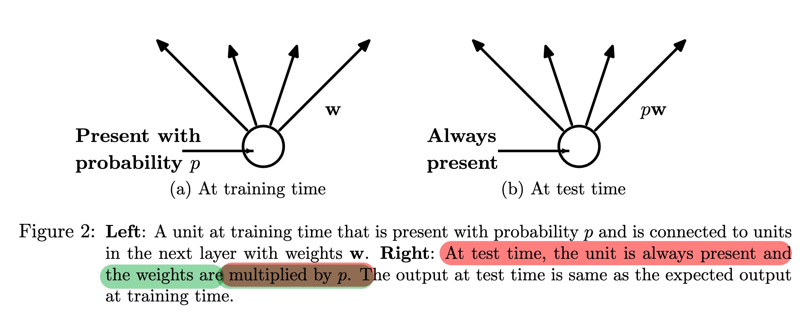
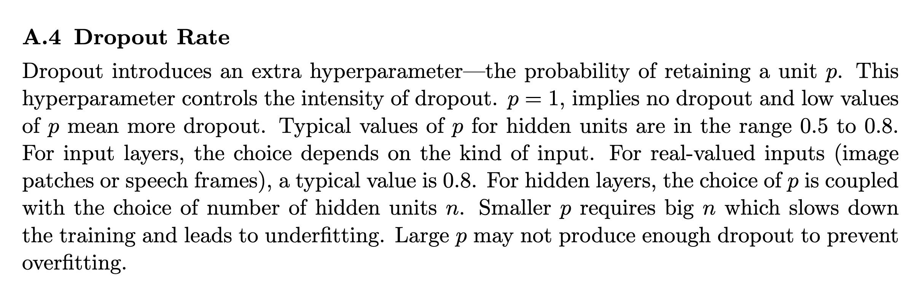

## Questions:

In our NN from scratch implementation, for Dropout, why we have 
```python
self.mask = np.random.binomial(1, 1 - self.p, size=input.shape) / (1 - self.p)
```
?

## Answer:

Inverted Dropout: keeping the expected activation magnitude constant

When you apply Dropout during training, you randomly "drop" (zero out) each unit with probability $p$. If you only did

```python
mask = np.random.binomial(1, 1 - p, size=input.shape)
output = input * mask
```

then on average only a fraction $(1-p)$ of your units would be "alive," so the total activation magnitude would shrink by a factor of $(1-p)$.  To compensate, you can **scale up** the remaining units by $\tfrac{1}{1 - p}$ so that the expected sum of activations stays the same as it would have been without dropout.  That's why we do:

```python
self.mask = np.random.binomial(1, 1 - self.p, size=input.shape) / (1 - self.p)
```

1. **Sampling the mask**  
   `np.random.binomial(1, 1 - p, size=input.shape)` generates a matrix of 0s and 1s where each entry is 1 (unit kept) with probability $(1 - p)$, or 0 (unit dropped) with probability $p$.

2. **Scaling by \(1/(1-p)\)**  
   Dividing by $(1 - p)$ scales each kept unit up so that
   $$
     \mathbb{E}[\text{mask}_{ij}] = \frac{(1-p)}{1-p} = 1,
   $$
   and thus
   $$
     \mathbb{E}[\text{input}_{ij} \times \text{mask}_{ij}] = \text{input}_{ij}.
   $$
   In other words, the expected activation remains exactly the same as without dropout.

3. **Why "inverted" dropout**  
   By scaling at *training* time, you don't need to do any special scaling at *inference* time—when you set `self.training = False`, your `forward` simply returns the raw inputs (no mask), and you've already preserved the correct activation magnitudes.

This approach—often called **inverted dropout**—is the standard way to implement dropout because it simplifies the forward pass at test time (no extra scaling needed) while ensuring that both training and inference use activations on the same scale.


## Compared to the initial dropout implementation

With the "inverted" version you're using, you scale **during training** so that at test time you don't have to do anything special—your forward pass is just a plain feed-forward with no masking or scaling.   

By contrast, the "original" (or naïve) dropout implementation works like this:

1. **Training**  
   ```python
   mask = np.random.binomial(1, 1 - p, size=input.shape)
   output = input * mask
   ```
   – You drop units but **do not** rescale them.  
2. **Inference**  
   ```python
   output = input * (1 - p)
   ```
   – You multiply every activation by the keep probability \((1-p)\) to match the expected magnitude during training.


### Key differences

|                           | Original Dropout                         | Inverted Dropout                          |
|:-------------------------:|:----------------------------------------:|:-----------------------------------------:|
| **Train-time scaling**    | None                                     | Scale kept units by \(1/(1-p)\)          |
| **Test-time scaling**     | Multiply activations by \((1-p)\)        | None (just pass activations through)     |
| **Code simplicity at test** | Requires an extra scaling step         | Forward is identical in train vs. test   |
| **Expected activation**   | Needs correction at test                 | Already corrected during training        |


### Why inverted dropout is preferred

- **No special inference logic.** Once you've scaled by \(1/(1-p)\) during training, your network's layers don't need to know whether they're in train or test mode: you simply skip the mask in test mode.
- **Consistent magnitudes.** Both training and inference see activations on the same scale, which can improve numerical stability.
- **Cleaner code.** You only branch on `training` in the dropout layer; all other layers and the rest of your code remain oblivious.

In short, inverted dropout trades a little extra work during training (the scaling) for a simpler, faster, and more robust inference pass.

See the original article proposing Dropout:
- [https://www.cs.toronto.edu/~hinton/absps/JMLRdropout.pdf](https://www.cs.toronto.edu/~hinton/absps/JMLRdropout.pdf)



## Still lost? Things don't add up?

<details>
<summary>
Surprise!
</summary>
Hhhahaha, the <b>p</b> in the original article is the probability of a unit being <b>present</b>, while in our implementation (and in the implementation of Tensorflow and PyTorch), it is the probability of a unit being <b>dropped</b>. 


</details>

